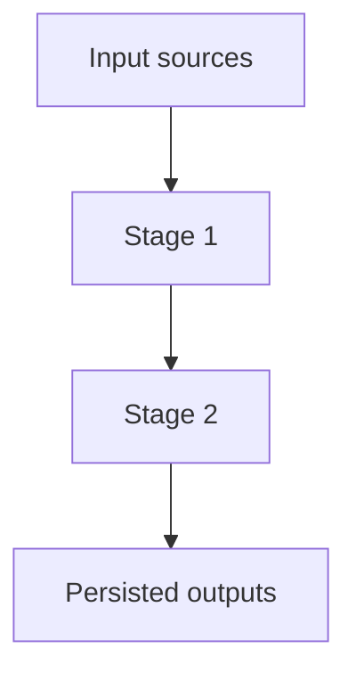

# Code Assessments

Use this skill to turn visible source code, docs, notebooks, tests, and existing local files into polished Markdown assessment reports. The default style is **v2**: input/output-table-first, stage-by-stage, source-backed, and explicit about unavailable runtime facts.

## Operating Rules

- Ground every concrete statement in visible code, docs, notebooks, tests, config, logs, sample files, or existing local outputs.
- Preserve exact source paths, folder names, file names, table names, dataframe names, model names, prompt names, config keys, and identifiers. Keep typos when they exist in source paths.
- Mark unsupported facts as `unknown from code`, `unknown from local disk`, or `not visible in reviewed source`.
- Do not infer row counts, schemas, metrics, token usage, source lineage, output contents, runtime success, or production behavior unless visible from source or readable existing files.
- Compute row/column counts only from existing local files that can be read without creating new pipeline artifacts.
- Do not run production pipelines, Streamlit apps, API calls, LLM calls, model training, scoring jobs, network ingestion, or write-heavy jobs unless the user explicitly asks.
- Use exact paths in backticks for traceability.
- Do not leave bracketed placeholders, TODO, TBD, FIXME, or question-mark filler in a finished report.
- When code and docs conflict, say so and prefer code behavior unless the task asks for documentation intent.
- If a report set is requested in a central folder, write only the requested assessment files there and leave existing report folders unchanged unless asked.

## Default Deliverable

Create one Markdown report per requested module unless the user asks for a single consolidated report. For centralized folders, use the filenames and paths the user provides exactly.

Each report should contain these sections unless a section is irrelevant and you explain why:

1. Title and scope
2. Architecture Summary
3. Source Inventory
4. Module Overview Table
5. Input Contract and Provenance
6. Stage-by-stage sections with detailed Input, Processing, Output, and Persistence tables
7. Model, Prompt, Formula, or Rule Details
8. Persisted Outputs and In-Memory Outputs
9. Key Configuration Parameters
10. Full Pipeline Data-Flow Diagram
11. Source Provenance
12. Reasonableness Assessment
13. Open Gaps and Unknowns

Prefer dense, auditable tables over long prose. Use prose to summarize architecture and judgment, not to replace source-backed IO detail.

## Inspection Workflow

1. Scope the assessment
   - Identify the requested module root, related docs, notebooks, scripts, configs, tests, and existing outputs.
   - Note whether the user asked for v1 narrative reports, v2 detailed IO-table reports, or another format. If unspecified, use v2.

2. Build the source inventory
   - Use fast local search to list relevant files, normally with `rg --files`.
   - Prioritize entrypoints, orchestrators, pipeline scripts, notebooks, README files, configs, tests, schema definitions, generated reports, and sample data.
   - Ignore caches, virtual environments, large binary artifacts, and unrelated generated folders unless they are explicit outputs to assess.

3. Trace the workflow
   - Find the entrypoint and stage order.
   - Trace inputs into intermediate dataframes, transformations, model calls, ranking logic, prompts, guardrails, persistence, and final outputs.
   - Capture both persisted artifacts and important in-memory objects.

4. Inspect data safely
   - For readable local CSV, JSON, Parquet, SQLite, Excel, or text files, collect row counts, column counts, visible schema, and small previews only when this does not run a pipeline.
   - For notebooks, inspect source cells and outputs already saved in the notebook. Do not execute cells unless the user asks.
   - For missing files or runtime-only outputs, write `unknown from local disk` or `unknown from code`.

5. Classify provenance
   - Label each source as `internal source`, `external source`, `derived`, or `unknown from code` only when supported.
   - If provenance is implied by a path, naming convention, or README but not proven, describe the evidence and mark it as unconfirmed.

6. Extract detailed logic
   - For rule-based systems, capture formulas, constants, weights, priority order, tie-breakers, caps, dedupe rules, overrides, filters, and ranking behavior.
   - For ML systems, capture target, label construction, features, train/test split, models, hyperparameters, metrics, artifact paths, scoring schema, and monitoring only when visible.
   - For LLM/API systems, capture provider, model, prompt templates, parser, token limits, temperature, retry behavior, dedupe logic, scoring, saved JSON, and failure handling only when visible.

7. Write the report
   - Start with architecture, then use IO tables to make each stage auditable.
   - Include a data-flow diagram in Mermaid when useful.
   - End with reasonableness and open gaps.

8. Validate before finalizing
   - Confirm requested files exist in the requested folder.
   - Confirm each report has `Module Overview Table`, at least one `Input` table, at least one `Output` table, source provenance language, and explicit unknowns where needed.
   - Scan for placeholder or unfinished marker text.
   - Spot-check formulas, config values, model names, prompt details, schemas, and paths against source.

## Report Structure

Use this shape for v2 reports.

````markdown
# Code Assessment V2: Module Name

Source root: `exact/path/to/module`
Assessment date: YYYY-MM-DD
Assessment mode: Static review of visible source, docs, notebooks, tests, and existing local files.

## Architecture Summary

Concise architecture summary grounded in source.

## Source Inventory

| Path | Type | Role in Assessment | Notes |
|---|---|---|---|
| `exact/path` | Python / notebook / data / config / doc | Entrypoint / input / output / test | Source-backed note |

## Module Overview Table

| Stage | Stage Name | Main Code / Notebook | Primary Inputs | Primary Outputs | Persistence | Runtime Status From Review |
|---:|---|---|---|---|---|---|
| 1 | Ingest | `path` | Source files or tables | DataFrame or object | Memory or file path | visible / unknown from code |

## Input Contract and Provenance

| Input Name | Path / Object | Format | Rows | Columns | Key Fields | Source Provenance | Consumer | Evidence |
|---|---|---|---:|---:|---|---|---|---|
| Customer profile | `path` | CSV | unknown from local disk | unknown from local disk | visible columns or unknown | unknown from code | Stage 1 | `source file` |

## Stage 1: Stage Name

### Input Files / Tables / DataFrames

| Input | Source Path or Object | Required Columns / Keys | Type / Shape | Description | Evidence |
|---|---|---|---|---|---|
| Input dataset | `path_or_dataframe` | `customer_id`, `score` | DataFrame | Source-backed role | `code path` |

### Processing Rules

| Step | Logic / Formula / Rule | Parameters | Evidence |
|---:|---|---|---|
| 1 | Exact transformation or `unknown from code` | Config keys or constants | `code path` |

### Output Schema

| Output Field | Type | Meaning | Source Logic | Nullable / Default |
|---|---|---|---|---|
| `field_name` | string / int / float / unknown | Meaning from source | Formula or assignment | unknown from code |

### Persistence

| Output | Path / Object | Format | Write Mode | Downstream Consumer | Evidence |
|---|---|---|---|---|---|
| Stage output | `path` | CSV / Parquet / JSON / memory | overwrite / append / unknown | downstream stage | `code path` |

## Full Pipeline Data-Flow Diagram



## Open Gaps and Unknowns

| Gap | Why It Is Unknown | Impact | How To Resolve |
|---|---|---|---|
| Runtime row counts | Pipeline was not executed | Output volume cannot be confirmed | Run approved pipeline or inspect production logs |
````

## Specialized Tables

Add the tables below when the module type requires them.

### ML Workflow Table

| Item | Value From Source | Evidence | Gap |
|---|---|---|---|
| Target | exact target or `unknown from code` | `path` | Missing if not visible |
| Features | exact feature list or derivation | `path` | Missing if generated dynamically |
| Model | class / library / artifact | `path` | Missing if loaded externally |
| Metrics | metric names and values if visible | `path` | Values unknown unless stored |
| Artifacts | model paths / encoders / reports | `path` | Missing runtime artifacts |

### LLM / Prompt Table

| Item | Value From Source | Evidence | Gap |
|---|---|---|---|
| Provider / model | exact value or `unknown from code` | `path` | Missing env/runtime config |
| Prompt template | prompt file/function summary | `path` | Do not quote long prompts unnecessarily |
| Parameters | temperature, token limit, retries | `path` | Unknown if only environment driven |
| Parser | JSON/parser/schema validation | `path` | Unknown if not implemented |
| Saved response | output path/object | `path` | Runtime contents unknown |

### Rule / Arbitration Table

| Rule Order | Rule / Formula | Inputs | Constants / Weights | Tie-Breaker | Evidence |
|---:|---|---|---|---|---|
| 1 | Exact rule or formula | fields used | values from config/code | exact tie logic or unknown | `path` |

### Configuration Table

| Config Key | Value | Defined In | Used By | Assessment Note |
|---|---|---|---|---|
| `CONFIG_KEY` | exact value or `unknown from code` | `path` | stage/function | Source-backed note |

### Reasonableness Assessment Table

| Area | What Looks Reasonable | Risk / Concern | Evidence | Suggested Follow-Up |
|---|---|---|---|---|
| Inputs | Source-backed positive note | Concrete risk | `path` | Practical next step |

## Style Guidance

- Write in clear English with compact paragraphs.
- Use tables for contracts, schemas, provenance, configs, formulas, and outputs.
- Use bullet lists only when a table would be awkward.
- Keep source-backed facts separate from assessment judgment.
- Prefer `unknown from code` over speculation.
- Include worked examples only when visible in code, docs, sample files, tests, notebooks, or existing outputs.
- If the user asks for a specific example style, mirror its granularity and section pattern while keeping facts grounded in the assessed module.

## Final Response After Writing Reports

Summarize:

- Files created or updated.
- Validation performed.
- Any important gaps or limits, especially skipped runtime execution.
- Any files intentionally left unchanged.
